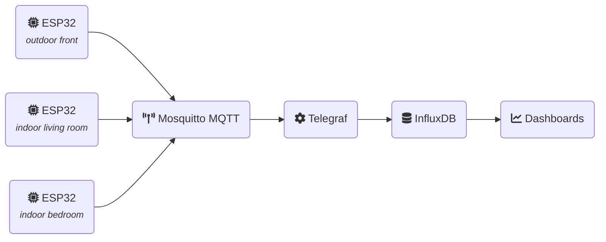

ESP-32 home sensor
==================

> ESP32 DevKit v1 home sensor connected via I2C to a BME280 sensor which
> measure temperature, humidity and pressure. Measurements are sent over MQTTv5
> to [Mosquitto MQTT broker](https://mosquitto.org) which are then consumed by
> [Telegraf](https://www.influxdata.com/time-series-platform/telegraf/) and
> persisted into [InfluxDB](https://www.influxdata.com).

## Overview



## Getting started

### ESP32

#### Requirements

- [espflash](https://esp-rs.github.io/book/tooling/espflash.html)
- [espmonitor](https://esp-rs.github.io/book/tooling/espmonitor.html)
- [espup](https://esp-rs.github.io/book/installation/installation.html#espup)

#### Pin-out

| Sensor | Pin Sensor  | ESP32 DevKit v1 Pin |
|--------|-------------|---------------------|
| BME280 | SDA         | GPIO 21 / D21       |
| BME280 | SCL         | GPIO 22 / D22       |
| BME280 | GND         | GND                 |
| BME280 | 3.3v        | 3v3                 |
| SCD30  | SDA         | GPIO 21 / D21       |
| SCD30  | SCL         | GPIO 22 / D22       |
| SCD30  | GND         | GND                 |
| SCD30  | 3.3v        | 3v3                 |
| SDS011 | RX          | GPIO 17 / U2:TXD    |
| SDS011 | TX          | GPIO 16 / U2:RXD    |
| SDS011 | GND         | GND                 |
| SDS011 | 5v          | 3v3                 |

Note: I2C devices share the same I2C bus (BME280, SCD30).

#### Configuration

Before flashing the device, you will need to configure parameters in the
`./cfg.toml` file, for example:

```toml
[esp32_home_sensor]
wifi_ssid = "my-wifi"
wifi_psk = "wifi-password"
hostname = "esp32-outdoor"
mqtt_hostname = "homie.local"
mqtt_port = 1883
mqtt_username = "esp32-outdoor"
mqtt_password = "someranddompassword"
mqtt_topic = "sensors"
measurement_interval_seconds = 300
location = "outdoor"
```

#### Development

Connect the device via USB, then run the following command to run flash and
retrieve logs from the device using espmonitor:

```bash
espup install

. $HOME/export-esp.sh

cargo run --release

# or run specific features/sensors
cargo run --release --features json,bme280 --no-default-features
```

#### Flashing

Connect the device via USB, then flash it with the following command:

```bash
. $HOME/export-esp.sh
cargo espflash flash --release
```

#### Available features

The following Cargo features allow you to enable/disable sensors and select the
MQTT message format to use:

| Feature | Description                       | Default |
|---------|-----------------------------------|---------|
| bme280  | Enable BME280 sensor              | yes     |
| sds011  | Enable SDS011 sensor              | yes     |
| influx  | Set MQTT payload format to Influx | no      |
| json    | Set MQTT payload format to Json   | yes     |

For example, to only enable BME280 with JSON format:

```bash
. $HOME/export-esp.sh
# enable BME280, SDS011 with MQTT message in JSON format (default)
cargo espflash flash --release

# enable BME280 with MQTT message in INFLUX format
cargo espflash flash --release --features influx,bme280 --no-default-features
```

### Setup infrastructure using Docker

Docker compose is used to setup the infrastructure. It is composed of 4 services:

- InfluxDB - persistent storage and basic dash-boarding
- Mosquitto - MQTT broker
- Telegraf - consume MQTT messages and store them in the database
- A bash job to setup InfluxDB user/token

First, review/adjust environment variables in `./infra/influxdb.env`. Then, for
each device (one per line) define a username/password in `./infra/mqtt.auth`
file. For example:

```yaml
esp32-outdoor:a19sn#sA94k!a5o10
esp32-indoor:a93KifAoBf7#01-jl
```

After what, run `docker compose up -d` to deploy the infrastructure.

Note, you might have to restart all containers to get the environment variables
re-populated into the container after being generated during initial boot.

You can visualise metrics by importing `./infra/influx-dashboard.json` as
dashboard into InfluxDB.


### Setup Home Assistant or other providers

It's possible to change the payload format of the MQTT message to JSON instead
of Influx by using the `--features json`.

Refer to the [Home Assistant documentation](./docs/home-assistant.md) for
details on how to set this up.


