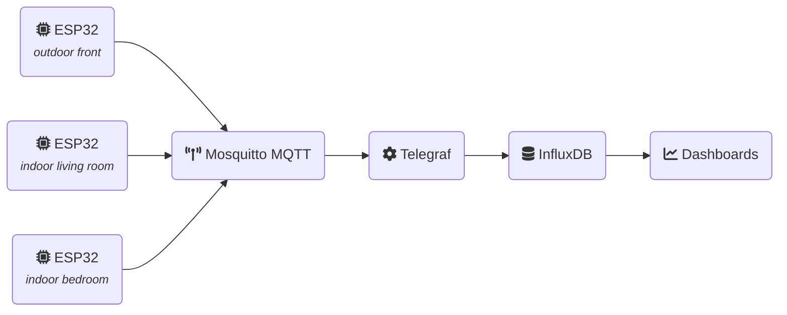

ESP-32 home sensor
==================

> ESP32 DevKit v1 home sensor connected via I2C to a BME280 sensor which
> measure temperature, humidity and pressure. Measurements are sent over MQTTv5
> to [Mosquitto MQTT broker](https://mosquitto.org) which are then consumed by
> [Telegraf](https://www.influxdata.com/time-series-platform/telegraf/) and
> persisted into [InfluxDB](https://www.influxdata.com).

## Overview



## Getting started

### ESP32

#### Requirements

- [espflash](https://esp-rs.github.io/book/tooling/espflash.html)
- [espmonitor](https://esp-rs.github.io/book/tooling/espmonitor.html)
- [espup](https://esp-rs.github.io/book/installation/installation.html#espup)

#### Pin-out

| Pin  | ESP32 DevKit v1 Pin |
|------|---------------------|
| SDA  | GPIO 21 / D21       |
| SCL  | GPIO 22 / D22       |
| GND  | GND                 |
| 3.3v | 3v3                 |

#### Configuration

Before flashing the device, you will need to configure parameters in the
`./cfg.toml` file, for example:

```toml
[esp32_home_sensor]
wifi_ssid = "my-wifi"
wifi_psk = "wifi-password"
hostname = "esp32-outdoor"
mqtt_hostname = "homie.local"
mqtt_port = 1883
mqtt_username = "esp32-outdoor"
mqtt_password = "someranddompassword"
mqtt_topic = "sensors"
location = "outdoor"
```

#### Development

Connect the device via USB, then run the following command to run flash and
retrieve logs from the device using espmonitor:

```bash
. $HOME/export-esp.sh
cargo run
```

#### Flashing

Connect the device via USB, then flash it with the following command:

```bash
. $HOME/export-esp.sh
cargo espflash --release
```

### Setup infrastructure using Docker

Docker compose is used to setup the infrastructure. It is composed of 4 services:

- InfluxDB - persistent storage and basic dash-boarding
- Mosquitto - MQTT broker
- Telegraf - consume MQTT messages and store them in the database
- A bash job to setup InfluxDB user/token

First, review/adjust environment variables in `./infra/influxdb.env`. Then, for
each device (one per line) define a username/password in `./infra/mqtt.auth`
file. For example:

```yaml
esp32-outdoor:a19sn#sA94k!a5o10
esp32-indoor:a93KifAoBf7#01-jl
```

After what, run `docker compose up -d` to deploy the infrastructure.

You can visualise metrics by importing `./infra/influx-dashboard.json` as
dashboard into InfluxDB.


